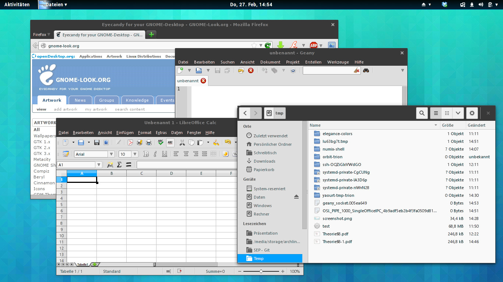

### NumixShell UI Theme

The theme requires the following software to be present on the
target system:

    - Gnome User Theme Shell Extension
    - Gnome Shell "elegance-colors" theme engine
    - Gnome-Tweak-Tool to set themes
    - The "Roboto" font (used for the shell theme)

To install this theme, copy the contents of

    - themes/ to ~/.local/share/themes
    - elegance-colors to ~/.config/elegance-colors

The fonts and icons used in the screenshot are:

    - Window title font: DejaVu Sans Bold
    - Interface font: Segoe UI 8 (MS Windows 8 Fonts)
    - Icon theme: Oxygen (KDE icon theme)
    - Cursor theme: Vanilla-DMZ
    
